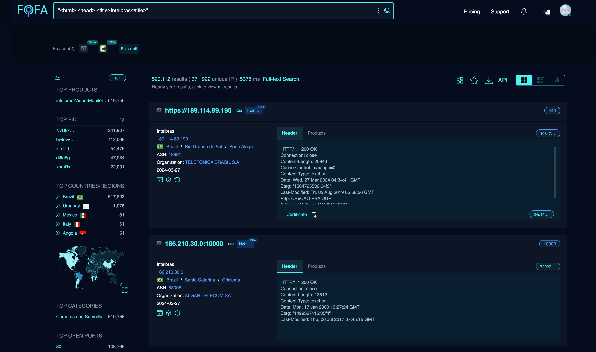
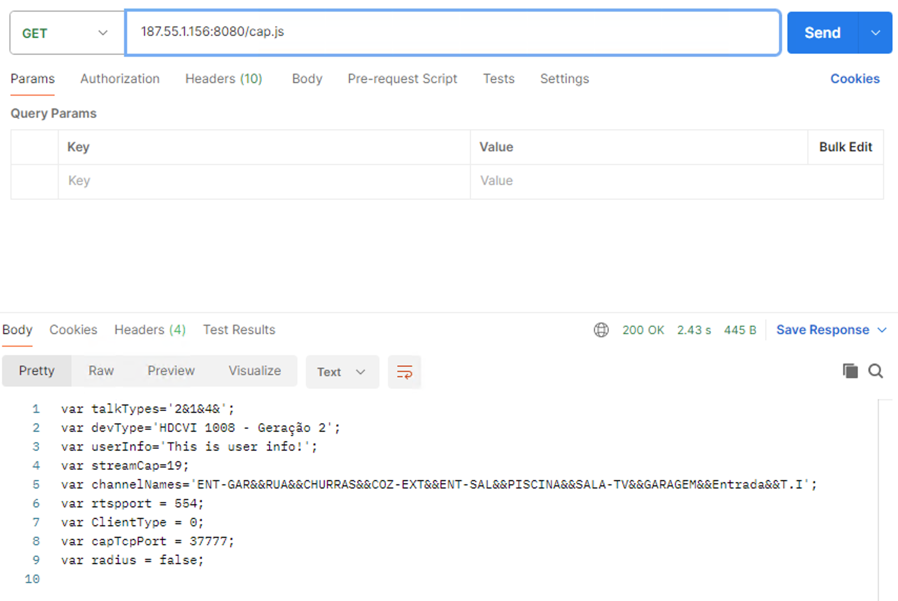
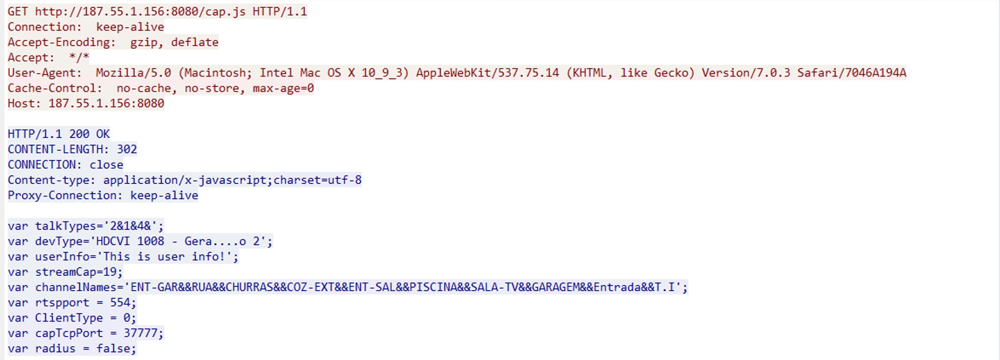

# Unrestricted Access and Potential Exposure of Sensitive Information on Intelbras DVR Series

## **Vulnerability Summary**

The HTTP GET request to **`/cap.js`** on the server Intelbras DVR reveals several potentially sensitive pieces of information that are not properly protected or encrypted. The disclosed information includes device types, user information, streaming capabilities, network ports, and configurations which could be exploited by attackers to gain unauthorized access or conduct targeted attacks, affecting over 520,000 devices on the Internet.

## **Affected Models**

MHDX 1004, MHDX 1008, MHDX 1016, MHDX 5016, HDCVI 1008, HDCVI 1016

## Exploitation

Launch an HTTP GET request to the target device: http://127.0.0.1/cap.js

## Reproduction Details

Several cases on the Internet were randomly selected:

http://143.137.206.226:8080/cap.js 

http://189.114.89.190/cap.js

http://143.137.206.68:8080/cap.js

http://170.246.250.145:8080/cap.js

http://191.241.145.3:37777/cap.js

http://189.92.17.151:91/cap.js

## Actual Result

## Fix Recommendation

It is recommended to restrict access to the administrative interfaces of the device to trusted IP addresses only and apply network-level authentication.
